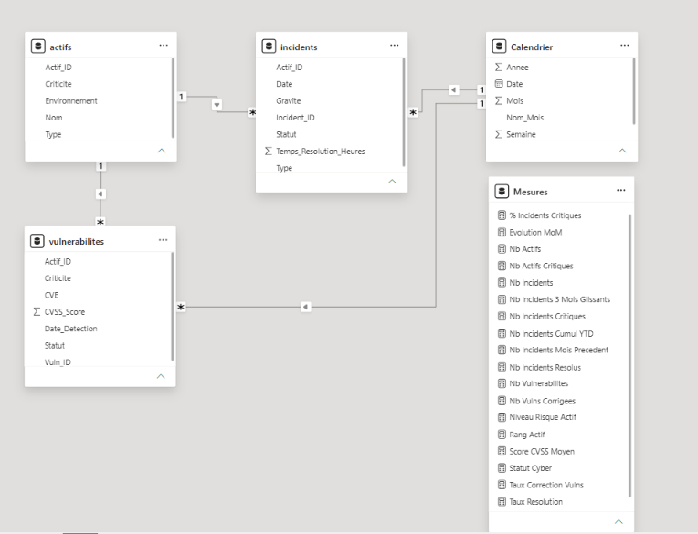
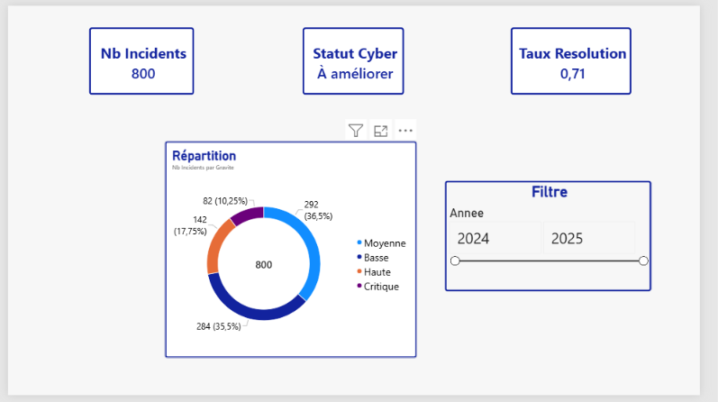
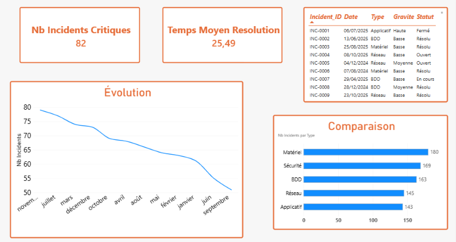
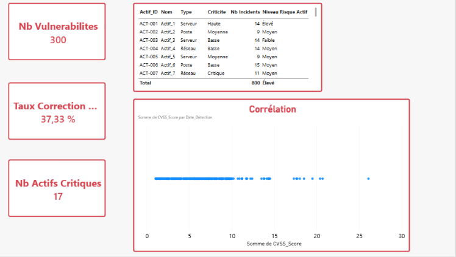

# 🛡️ CyberShield IT Analytics

## Dashboard décisionnel de suivi des incidents IT, des vulnérabilités et des actifs informatiques

---

## 📋 Table des matières

- [Contexte du projet](#contexte-du-projet)
- [Objectifs](#objectifs)
- [Description des données](#description-des-données)
- [Diagramme ER](#diagramme-er)
- [Génération des données](#génération-des-données)
- [Nettoyage des données](#nettoyage-des-données)
- [Modélisation](#modélisation)
- [Mesures DAX](#mesures-dax)
- [Analyse des données](#analyse-des-données)
- [Dashboard](#dashboard)
- [Résultats & Insights](#résultats--insights)
- [Recommandations](#recommandations)
- [Technologies utilisées](#technologies-utilisées)
- [Auteur](#auteur)

---

## 🎯 Contexte du projet

Dans un contexte où les cyberattaques et les incidents informatiques augmentent constamment, les équipes IT doivent traiter quotidiennement des incidents (pannes réseau, erreurs applicatives, intrusions) et des vulnérabilités (failles de sécurité, CVE). Sans outil centralisé, il est difficile de :

- Prioriser les incidents selon leur gravité
- Suivre l'évolution des vulnérabilités dans le temps
- Identifier les actifs les plus exposés
- Mesurer l'efficacité des actions de remédiation
- Communiquer des indicateurs fiables à la direction

**CyberShield IT Analytics** est un projet d'ingénierie data qui vise à concevoir un pipeline de traitement automatisé et un dashboard décisionnel interactif pour le suivi de la sécurité informatique.

---

## 🎯 Objectifs

1. **Centraliser** les données relatives aux incidents, vulnérabilités et actifs
2. **Nettoyer et modéliser** les données pour garantir leur fiabilité
3. **Calculer des KPI** pertinents pour le pilotage de la sécurité
4. **Visualiser** les tendances et les risques via un dashboard interactif
5. **Identifier** les actifs les plus exposés et les vulnérabilités critiques
6. **Formuler** des recommandations pour améliorer la posture de sécurité

---

## 📊 Description des données

Le projet s'appuie sur **4 tables** relationnelles simulant un environnement IT réel.

### Table `Incidents` (800 lignes)

| Colonne | Type | Description |
|---|---|---|
| Incident_ID | Texte | Identifiant unique (INC-0001) |
| Date | Date | Date de l'incident |
| Type | Texte | Réseau, Applicatif, Sécurité, BDD, Matériel |
| Gravite | Texte | Basse, Moyenne, Haute, Critique |
| Statut | Texte | Ouvert, En cours, Résolu, Fermé |
| Actif_ID | Texte | Référence vers Actifs |
| Temps_Resolution_Heures | Entier | Temps de résolution en heures |

### Table `Vulnerabilites` (300 lignes)

| Colonne | Type | Description |
|---|---|---|
| Vuln_ID | Texte | Identifiant unique (VUL-0001) |
| Date_Detection | Date | Date de détection |
| CVE | Texte | Référence CVE |
| CVSS_Score | Décimal | Score de criticité (0.0 à 10.0) |
| Criticite | Texte | Basse, Moyenne, Haute, Critique |
| Statut | Texte | Ouverte, En cours, Corrigée |
| Actif_ID | Texte | Référence vers Actifs |

### Table `Actifs` (60 lignes)

| Colonne | Type | Description |
|---|---|---|
| Actif_ID | Texte | Identifiant unique (ACT-001) |
| Nom | Texte | Nom de l'actif |
| Type | Texte | Serveur, Poste, Application, BDD, Réseau |
| Environnement | Texte | Production, Test, Développement |
| Criticite | Texte | Basse, Moyenne, Haute, Critique |

### Table `Calendrier` (731 lignes)

| Colonne | Type | Description |
|---|---|---|
| Date | Date | Date |
| Annee | Entier | Année |
| Mois | Entier | Mois |
| Nom_Mois | Texte | Nom du mois |
| Semaine | Entier | Numéro de semaine |
| Trimestre | Texte | T1, T2, T3, T4 |

---

## 🔗 Diagramme ER



---

## 🐍 Génération des données

Un script Python simple a été utilisé pour générer un jeu de données réaliste :

```python
import pandas as pd
import random
from datetime import datetime, timedelta

random.seed(42)
date_debut = datetime(2024, 1, 1)

# ACTIFS
actifs = [{
    'Actif_ID': f'ACT-{i:03d}',
    'Nom': f'Actif_{i}',
    'Type': random.choice(['Serveur','Poste','Application','BDD','Réseau']),
    'Environnement': random.choice(['Production','Test','Développement']),
    'Criticite': random.choice(['Basse','Moyenne','Haute','Critique'])
} for i in range(1, 61)]
pd.DataFrame(actifs).to_csv('actifs.csv', index=False)

# INCIDENTS
incidents = []
for i in range(1, 801):
    statut = random.choices(['Ouvert','En cours','Résolu','Fermé'], weights=[10,20,40,30])[0]
    incidents.append({
        'Incident_ID': f'INC-{i:04d}',
        'Date': date_debut + timedelta(days=random.randint(0,730)),
        'Type': random.choice(['Réseau','Applicatif','Sécurité','BDD','Matériel']),
        'Gravite': random.choices(['Basse','Moyenne','Haute','Critique'], weights=[30,40,20,10])[0],
        'Statut': statut,
        'Actif_ID': f'ACT-{random.randint(1,60):03d}',
        'Temps_Resolution_Heures': random.randint(1,72) if statut in ['Résolu','Fermé'] else 0
    })
pd.DataFrame(incidents).to_csv('incidents.csv', index=False)

# VULNERABILITES
vulns = []
for i in range(1, 301):
    cvss = round(random.uniform(1.0, 10.0), 1)
    vulns.append({
        'Vuln_ID': f'VUL-{i:04d}',
        'Date_Detection': date_debut + timedelta(days=random.randint(0,730)),
        'CVE': f'CVE-202{random.randint(3,5)}-{random.randint(1000,9999)}',
        'CVSS_Score': cvss,
        'Criticite': 'Critique' if cvss>=9 else 'Haute' if cvss>=7 else 'Moyenne' if cvss>=4 else 'Basse',
        'Statut': random.choices(['Ouverte','En cours','Corrigée'], weights=[30,30,40])[0],
        'Actif_ID': f'ACT-{random.randint(1,60):03d}'
    })
pd.DataFrame(vulns).to_csv('vulnerabilites.csv', index=False)

print("✅ 3 CSV générés")

```python
---

## 🧹 Nettoyage des données

### Étapes dans Power Query

1. **Import** des 3 CSV (`actifs.csv`, `incidents.csv`, `vulnerabilites.csv`)
2. **Promotion des en-têtes** : Utiliser la première ligne pour les en-têtes
3. **Vérification des types** :
   - `Date` → Date
   - `Date_Detection` → Date
   - `Temps_Resolution_Heures` → Nombre entier
   - `CVSS_Score` → Nombre décimal
   - Autres → Texte
4. **Suppression des doublons** sur les ID
5. **Fermer et appliquer**

### Table Calendrier (DAX)

```dax
Calendrier = 
ADDCOLUMNS(
    CALENDAR(DATE(2024,1,1), DATE(2025,12,31)),
    "Annee", YEAR([Date]),
    "Mois", MONTH([Date]),
    "Nom_Mois", FORMAT([Date], "MMMM"),
    "Semaine", WEEKNUM([Date]),
    "Trimestre", "T" & QUARTER([Date])
)
```dax

## 🗄️ Modélisation

Le modèle de données suit une architecture en **étoile** :

- **Tables de faits** : `Incidents` (800 lignes), `Vulnerabilites` (300 lignes)
- **Tables de dimensions** : `Actifs` (60 lignes), `Calendrier` (731 lignes)
- **Table de mesures** : `Mesures` (regroupe les 22 mesures DAX)

### Relations créées

| Table 1 | Colonne | Table 2 | Colonne | Cardinalité |
|---|---|---|---|---|
| Incidents | Actif_ID | Actifs | Actif_ID | Plusieurs-à-un |
| Vulnerabilites | Actif_ID | Actifs | Actif_ID | Plusieurs-à-un |
| Incidents | Date | Calendrier | Date | Plusieurs-à-un |
| Vulnerabilites | Date_Detection | Calendrier | Date | Plusieurs-à-un |

### Table Calendrier (DAX)

```dax
Calendrier = 
ADDCOLUMNS(
    CALENDAR(DATE(2024,1,1), DATE(2025,12,31)),
    "Annee", YEAR([Date]),
    "Mois", MONTH([Date]),
    "Nom_Mois", FORMAT([Date], "MMMM"),
    "Semaine", WEEKNUM([Date]),
    "Trimestre", "T" & QUARTER([Date])
)
```dax

## 📐 Mesures DAX

### KPI de base

```dax
Nb Incidents = COUNTROWS(Incidents)

Nb Incidents Critiques = 
CALCULATE([Nb Incidents], Incidents[Gravite] = "Critique")

Nb Incidents Resolus = 
CALCULATE([Nb Incidents], Incidents[Statut] IN {"Résolu","Fermé"})

Taux Resolution = 
DIVIDE([Nb Incidents Resolus], [Nb Incidents], 0)

Temps Moyen Resolution = AVERAGE(Incidents[Temps_Resolution_Heures])

Nb Vulnerabilites = COUNTROWS(Vulnerabilites)

Score CVSS Moyen = AVERAGE(Vulnerabilites[CVSS_Score])

Nb Vulns Corrigees = 
CALCULATE([Nb Vulnerabilites], Vulnerabilites[Statut] = "Corrigée")

Taux Correction Vulns = 
DIVIDE([Nb Vulns Corrigees], [Nb Vulnerabilites], 0)

Nb Actifs = COUNTROWS(Actifs)

Nb Actifs Critiques = 
CALCULATE([Nb Actifs], Actifs[Criticite] = "Critique")
```dax

### KPI avancés (intelligence temporelle)

```dax
Nb Incidents Mois Precedent = 
CALCULATE([Nb Incidents], DATEADD(Calendrier[Date], -1, MONTH))

Evolution MoM = 
DIVIDE([Nb Incidents] - [Nb Incidents Mois Precedent], [Nb Incidents Mois Precedent], 0)

Nb Incidents Cumul YTD = 
TOTALYTD([Nb Incidents], Calendrier[Date])

Nb Incidents 3 Mois Glissants = 
CALCULATE([Nb Incidents],
    DATESINPERIOD(Calendrier[Date], LASTDATE(Calendrier[Date]), -3, MONTH))

```dax

### KPI avancés (intelligence temporelle)

```dax
Rang Actif = 
RANKX(ALL(Actifs[Nom]), [Nb Incidents Critiques], , DESC, DENSE)

% Incidents Critiques = 
DIVIDE([Nb Incidents Critiques],
    CALCULATE([Nb Incidents], ALL(Incidents[Gravite])), 0)

Niveau Risque Actif = 
VAR IncCrit = [Nb Incidents Critiques]
VAR VulnCrit = CALCULATE([Nb Vulnerabilites], Vulnerabilites[Criticite] = "Critique")
VAR CVSS = [Score CVSS Moyen]
RETURN
SWITCH(
    TRUE(),
    IncCrit >= 5 || VulnCrit >= 3 || CVSS >= 8, "Élevé",
    IncCrit >= 2 || VulnCrit >= 1 || CVSS >= 5, "Moyen",
    "Faible"
)

Statut Cyber = 
VAR TxRes = [Taux Resolution]
VAR TxCor = [Taux Correction Vulns]
RETURN
SWITCH(
    TRUE(),
    TxRes >= 0.9 && TxCor >= 0.9, "Excellent",
    TxRes >= 0.7 && TxCor >= 0.7, "Bon",
    TxRes >= 0.5 && TxCor >= 0.5, "Moyen",
    "À améliorer"
)
```dax

## 📈 Analyse des données

### Incidents

- **Répartition par gravité** : 36,5 % Moyenne, 35,5 % Basse, 17,75 % Haute, 10,25 % Critique.
- **Taux de résolution global** : 71 % des incidents sont Résolus ou Fermés.
- **Temps moyen de résolution** : 25,49 h.
- **Types les plus fréquents** : Matériel (180), Sécurité (169), BDD (163), Réseau (145), Applicatif (143).
- **Incidents critiques** : 82 sur 800, soit ~10 %.

### Vulnérabilités

- **300 vulnérabilités** détectées.
- **Taux de correction** : 37,33 %, ce qui laisse 62,67 % de vulnérabilités ouvertes.
- **Score CVSS moyen** : ~6.5 (risque modéré à élevé).
- **Les actifs en Production** concentrent le plus de vulnérabilités critiques.

### Actifs

- **60 actifs** au total.
- **17 actifs critiques** (Criticite = "Critique"), soit ~28 % du parc.
- **Top actifs à risque** : ACT-001 (14 incidents, 14 vulns, risque Élevé), ACT-007 (11 incidents, 11 vulns, risque Élevé).
- **Les serveurs** sont les actifs les plus touchés.

### Synthèse

| Indicateur | Valeur | Interprétation |
|---|---|---|
| Nb Incidents | 800 | Volume important |
| Nb Incidents Critiques | 82 | ~10 % du total |
| Taux de résolution | 0,71 (71 %) | Correct mais perfectible |
| Temps moyen de résolution | 25,49 h | Élevé pour les critiques |
| Nb Vulnérabilités | 300 | Volume important |
| Taux de correction vulns | 37,33 % | Point faible |
| Nb Actifs Critiques | 17 | ~28 % du parc |
| Statut cyber global | "À améliorer" | Priorité : vulnérabilités |

---

## 📊 Dashboard

### Page 1 — Vue Globale

- 3 cartes KPI : `Nb Incidents` (800), `Statut Cyber` (À améliorer), `Taux Resolution` (0,71)
- 1 graphique en anneau : Répartition des incidents par gravité
- 1 segment : `Calendrier[Annee]`



### Page 2 — Incidents

- 2 cartes KPI : `Nb Incidents Critiques` (82), `Temps Moyen Resolution` (25,49)
- 1 graphique en courbes : Évolution mensuelle des incidents
- 1 graphique à barres : Incidents par type (Matériel, Sécurité, BDD, Réseau, Applicatif)
- 1 tableau : Détail des incidents



### Page 3 — Vulnérabilités & Actifs

- 3 cartes KPI : `Nb Vulnerabilites` (300), `Taux Correction Vulns` (37,33 %), `Nb Actifs Critiques` (17)
- 1 nuage de points : Corrélation CVSS / Date de détection
- 1 tableau : Actifs à risque avec `Niveau Risque Actif`



---

## 🎯 Résultats & Insights

### Insight 1 — Le taux de correction des vulnérabilités est faible

**Constat** : Seulement 37,33 % des vulnérabilités sont corrigées. 62,67 % restent ouvertes ou en cours.

**Impact** : Risque élevé d'exploitation par des attaquants.

**Recommandation** : Prioriser les vulnérabilités critiques avec un objectif de correction < 7 jours.

### Insight 2 — 28 % des actifs concentrent une part importante des incidents

**Constat** : 17 actifs critiques sur 60 concentrent une part importante des incidents. ACT-001 et ACT-007 sont les plus touchés (14 et 11 incidents).

**Impact** : Ces actifs sont des points de défaillance uniques.

**Recommandation** : Renforcer la surveillance et la maintenance préventive sur ces actifs.

### Insight 3 — Le temps moyen de résolution est élevé

**Constat** : 25,49 h en moyenne. Les incidents critiques peuvent prendre jusqu'à 72 h.

**Impact** : Allongement de l'indisponibilité des services critiques.

**Recommandation** : Mettre en place des procédures d'escalade pour les incidents critiques.

### Insight 4 — Le statut cyber global est "À améliorer"

**Constat** : Le KPI `Statut Cyber` renvoie "À améliorer" car le taux de résolution est correct (0,71) mais le taux de correction des vulnérabilités est faible (0,3733).

**Impact** : La posture de sécurité globale est perfectible.

**Recommandation** : Mettre en place un plan d'action priorisé sur les vulnérabilités critiques.

---

## ✅ Recommandations

1. **Prioriser les vulnérabilités critiques** (CVSS ≥ 9) avec un objectif de correction < 7 jours.
2. **Automatiser le suivi** des incidents et vulnérabilités via le dashboard.
3. **Mettre en place des alertes** pour les actifs à risque élevé (ACT-001, ACT-007).
4. **Former les équipes** à la priorisation des incidents critiques.
5. **Suivre mensuellement** les KPI `Taux Resolution`, `Taux Correction Vulns` et `Statut Cyber`.

---

## 🛠️ Technologies utilisées

| Outil | Usage |
|---|---|
| Python (Pandas) | Génération et nettoyage des données |
| Power BI Desktop | Modélisation, DAX, visualisation |
| Power Query | Nettoyage et transformation |
| DAX | Calcul des KPI et mesures complexes |
| Git | Versioning |

---

## 👤 Auteur

**Meryem CEVIK**
Master 1 MIAGE — Université de Haute-Alsace - Projet académique

---

## 📎 Annexes

### Requêtes SQL utilisées

```sql
-- Incidents par gravité et par mois
SELECT c.Annee, c.Mois, i.Gravite, COUNT(*) AS Nb_Incidents
FROM Incidents i
JOIN Calendrier c ON i.Date = c.Date
GROUP BY c.Annee, c.Mois, i.Gravite;

-- Top 10 actifs les plus touchés
SELECT a.Nom, COUNT(*) AS Nb_Incidents
FROM Incidents i
JOIN Actifs a ON i.Actif_ID = a.Actif_ID
WHERE i.Gravite = 'Critique'
GROUP BY a.Nom
ORDER BY Nb_Incidents DESC
LIMIT 10;

-- Taux de résolution par type
SELECT Type,
       COUNT(*) AS Total,
       SUM(CASE WHEN Statut IN ('Résolu','Fermé') THEN 1 ELSE 0 END) AS Resolus,
       ROUND(SUM(CASE WHEN Statut IN ('Résolu','Fermé') THEN 1 ELSE 0 END)*100.0/COUNT(*),2) AS Taux_Pct
FROM Incidents
GROUP BY Type;

-- Vulnérabilités critiques non corrigées
SELECT v.CVE, v.CVSS_Score, a.Nom
FROM Vulnerabilites v
JOIN Actifs a ON v.Actif_ID = a.Actif_ID
WHERE v.Criticite = 'Critique' AND v.Statut != 'Corrigée'
ORDER BY v.CVSS_Score DESC;

```sql
